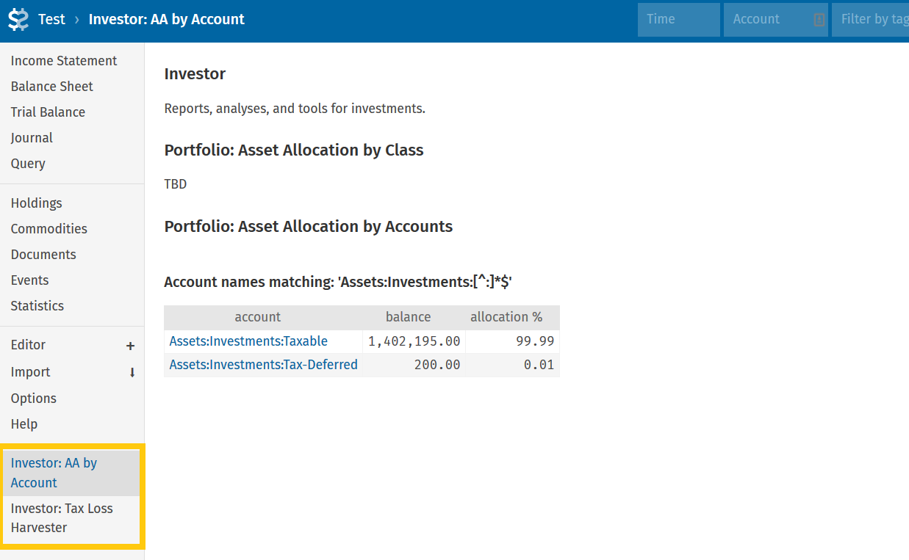
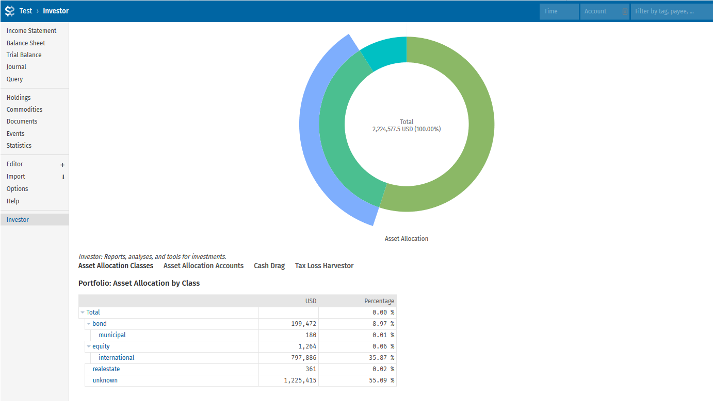

# Fava Investor

Fava Investor aims to be a comprehensive set of reports, analyses, and tools for
investments, for [Beancount](https://beancount.github.io/) and
[Fava](https://github.com/beancount/fava) (software for
[plain text, double entry bookkeeping](https://plaintextaccounting.org/)). It is developed as a
collection of modules, with each module offering a Fava plugin, a Beancount library, and
a shell command.

Interactivity and visualization are key for investing reports and tools, and hence the
primary focus is on Fava, even though all modules will aim to have all three interfaces.

### Current modules:
- [Visual, tree structured asset allocation by class](https://github.com/redstreet/fava_investor/tree/main/fava_investor/modules/assetalloc_class#readme)
- Asset allocation by account
- [Tax loss harvestor](https://github.com/redstreet/fava_investor/tree/main/fava_investor/modules/tlh#readme)
- [Cash drag analysis](https://github.com/redstreet/fava_investor/tree/main/fava_investor/modules/cashdrag#readme)
- [Summarizer](https://github.com/redstreet/fava_investor/tree/main/fava_investor/modules/summarizer#readme)




### Utilities

Fava Investor ships with `ticker-util`, which is a collection of utilities for:
- downloading information from Yahoo for commodities (tickers), and annotating your
  commodity declarations with metadata
- discovering relationships between tickers in your Beancount file, such as equivalent
  and substantially similar tickers, and tax loss harvesting partner groups, from a
  minimal and incomplete specification
- providing ISIN an other ticker identifying information to your importers

For more, install fava_investor via pip, and then see:
```
ticker-util --help
ticker-util relate --help
```


## Installation via pip
```bash
pip3 install fava-investor
```

Or to install the bleeding edge version from git:
```bash
pip3 install git+https://github.com/redstreet/fava_investor
```
See [#55](https://github.com/redstreet/fava_investor/issues/55) for MacOS installation.

## Running Fava Investor
### Running in Fava:
Add this to your beancount source, and start up fava as usual:
```
2000-01-01 custom "fava-extension" "fava_investor" "{}"
```

You should now see an 'Investor' link in the sidebar in fava. For more on how to
configure the extension, see the included `huge-example.beancount`.

### Running on the Command-Line:
The command line interface (CLI) is accessed using the `investor` command, which has
subcommands for each module. Eg:

```
investor assetalloc-class
investor tlh
investor --help
```

Both the CLI and the utility (`ticker-util`) use [click](https://click.palletsprojects.com/en/8.1.x/).
[See here](https://click.palletsprojects.com/en/8.1.x/shell-completion/#enabling-completion)
to enable shell completion in zsh, bash, or fish, which is highly recommended.

## Problems?
- Monitor the terminal you are running fava from to look for error output from
  fava_investor
- Include the error messages you see above when opening bug reports or asking for help
