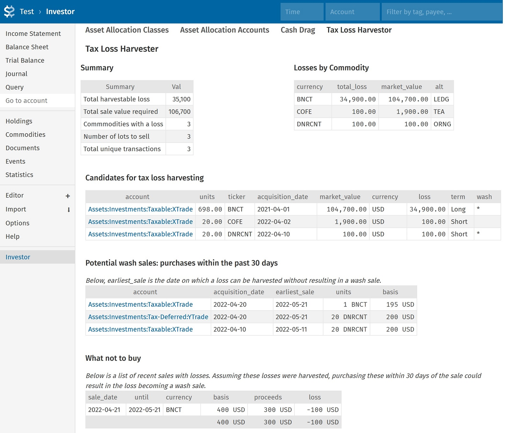

# Tax Loss Harvester

Reports on lots that can be tax loss harvested from your Beancount input file. Also
determines which of them would trigger wash sales.

See this article
**[Tax Loss Harvesting with Beancount](http://reds-rants.netlify.app/personal-finance/tax-loss-harvesting-with-beancount/)**
for more.

Example:



The example above shows a summary of what can be tax-loss harvested currently. This
includes the total harvestable loss, and the sale value required to harvest the loss.
Detailed and summary views of losses by commodity and lots is shown. Losses that would
not be allowable due to wash sales are marked.


## Installation
A Fava extension, a Beancount command line client, and a library are all included.
To install the Fava plugin, see [fava_investor](https://github.com/redstreet/fava_investor).

Command line client:
```
investor tlh example.bc
investor tlh --brief example.bc
```
The command line client also uses the same Fava configuration shown below.


## Configuration

Configure TLH by including the following lines in your Beancount source. Example:

```
2010-01-01 custom "fava-extension" "fava_investor" "{
  'tlh' : {
    'account_field': 'account',
    'accounts_pattern': 'Assets:Investments:Taxable',
    'loss_threshold': 50,
    'wash_pattern': 'Assets:Investments',
   },
   ...
}"
```

Optionally, include the `tlh_alternates` metadata in your commodity declarations. The
string you provide simply gets summarized into a table in the output (Fava and command
line), serving as an easy reminder for you. For example:

```
2010-01-01 commodity VTI
  tlh_alternates: "VOO"
```
---

The full list of configuration options is below:

#### `account_field` 

Default: LEAF(account)

BQL string that determines what is shown in the account column. If this is set to an
integer, it is replaced with one of the following built-in values:
- `0`: show the entire account name (same as setting it to `'account'`)
- `1`: show only the leaf of the account
- `2`: show only the last but one substring in the account hierarchy. Eg: if the account
  is `Assets:Investments:Taxable:XTrade:AAPL`, show simply `XTrade`

---

`accounts_pattern`

Default: ''

Regex of the set of accounts to search over for tax loss harvesting opportunities.
This allows you to exclude your tax advantaged and other non-investment accounts.

---

`loss_threshold`

Default: 1

Losses below this threshold will be ignored. Useful to filter out minor TLH
opportunities.

---

`wash_pattern`

Default: ''

Regex of the set of accounts to search over for possible wash sales. This allows you to
include your tax advantaged and all investment accounts.

---

`tlh_partners_meta_label`

Default: `tlh_alternates`

Specify the metadata _label_ used in your config to list "partner" funds for each fund
in its commodity declaration. Eg:

```
2000-01-01 commodity VTI
   tlh_partners: ITOT,VTHR
   
```
and

```
2000-01-01 custom "fava-extension" "fava_investor" "{
  'tlh' : {
      'accounts_pattern': 'Assets:Investments:Taxable',
      'wash_pattern': 'Assets:Investments',
      'tlh_partners_meta_label': 'tlh_partners',
   },
   ...
}
```

---

`substantially_similars_meta_label`

Default: `substantially_similars`

Specify the metadata _label_ used in your config to list substantially similar funds for
each fund in its commodity declaration. Eg:

```
2000-01-01 commodity VOO
   subst_similars: VFINX,VFIAX,FXAIX
   
```
and

```
2000-01-01 custom "fava-extension" "fava_investor" "{
  'tlh' : {
      'accounts_pattern': 'Assets:Investments:Taxable',
      'wash_pattern': 'Assets:Investments',
      'tlh_partners_meta_label': 'tlh_partners',
      'substantially_similars_meta_label': 'subst_similars`,
   },
   ...
}
```

## Limitations

- Filters in Fava do not work with TLH. Selecting filters on the GUI (eg: a time filter)
  will lead to unpredictable results

- Partial wash sales, or cases where it is not obvious as to how to match the purchases
  and sales, are not displayed due to their
  [complexity.](https://fairmark.com/investment-taxation/capital-gain/wash/wash-sale-matching-rules/)

- Booking via specific identification of shares is assumed on all taxable accounts. This
  translates to "STRICT" booking in beancount.

#### Disclaimer
None of the above is or should be construed as financial, tax, or other advice.
